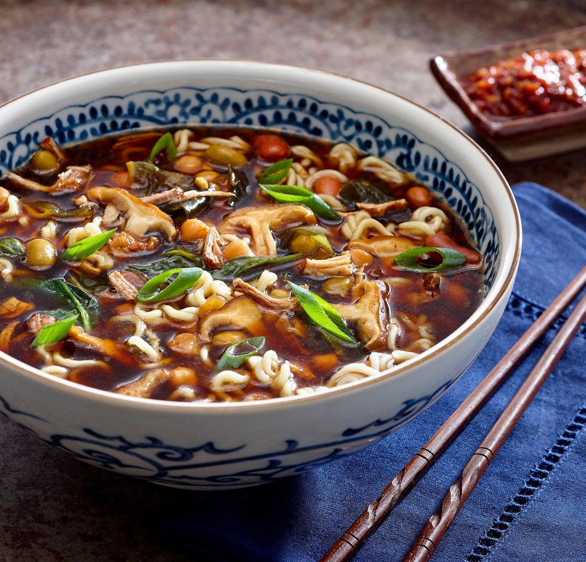

# recette soupe ramen
## exemple d'utilisation du markdown

## liste en ordre
1. First item
2. Second item
3. Third item
## unordered list
- First item
- Second item
- Third item
# GIF capture écran
(medias/2021-11-04_11-24-25.gif)
